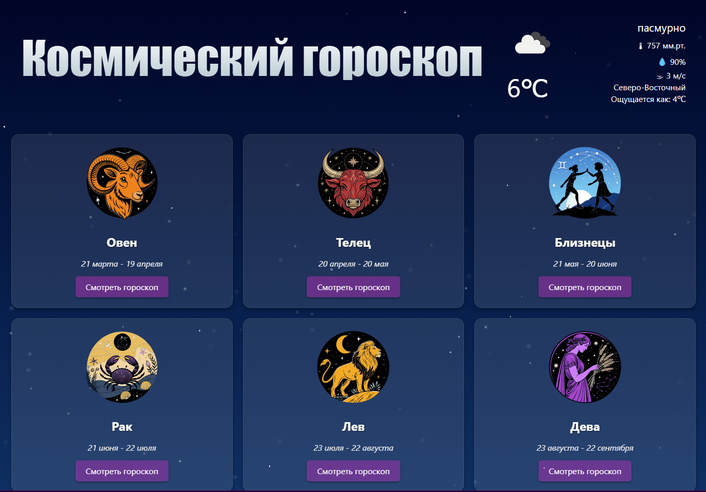

# Как установить

1. Установите Docker;
2. Клонируйте репозиторий или скопируйте файлы;

    # Dockerfile:

    >```Dockerfile
    >FROM python:3.11
    >
    >ENV PYTHONDONTWRITEBYTECODE=1
    >
    >ENV PYTHONUNBUFFERED=1
    >
    >WORKDIR /zodiac
    >
    >COPY requirements.txt .
    >
    >RUN pip install --no-cache-dir -r requirements.txt
    >
    >COPY . .
    >
    >EXPOSE 8000
    >
    >RUN python manage.py loaddata zodiac_app/fixtures/zodiac_app.json --app zodiac_app
    >
    >CMD ["gunicorn", "-k", "uvicorn.workers.UvicornWorker", "zodiac.asgi:application", "--bind", "0.0.0.0:8000"]
    >

3. Настройте .env файл;

    >```
    >
    >URL = 'http://api.openweathermap.org/data/2.5/weather'
    >APPID = "Ваш API token от сервиса openweathermap"
    >SECRET_KEY = "Django SECRET_KEY" 
    Django secret key можно получить подобным образом:
    ```python
    >python -c 'import random'
    >result = "".join([random.choice("abcdefghijklmnopqrstuvwxyz0123456789!@#$%^&*(-_=+)") for i in range(50)])


4. Запустите приложение с использованием docker run:
    ```cmd
    docker run -d -p 8000:8000 $(docker build -q .)

# Переходим на localhost:8000/ и получаем:


